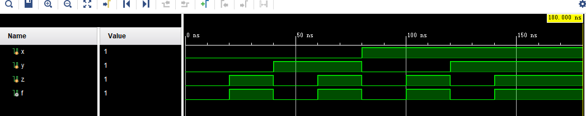

# 实验一 门级电路的实现

## 一、实验要求


需完成设计代码和仿真代码的实现，要求仿真代码实现所有真值的覆盖，并在提交报告时给出设计代码、仿真代码、RTL图和仿真波形图。

## 二、主要实验过程

使用`verilog`根据图示编写门级电路的代码，然后编写模拟程序，覆盖三个输入的8种可能，然后运行模拟，仿真，打开RTL图进行检验对比

## 三、主要实现代码

### Design 代码

```verilog
module door_design(X,Y,Z,F);
    input wire X,Y,Z;
    output wire F;
    and a1 (andXY,X,Y);
    and a2 (andYZ,Y,Z);
    not n1 (Z_n,Z);
    nor nor1 (f1,andXY,Z_n);
    or (F,f1,andYZ);
endmodule
```

### 仿真代码

```verilog
module door_simulation();
reg x,y,z;
wire f;
door_design door1 (.X(x),.Y(y),.Z(z),.F(f));
initial begin
    x = 0;y = 0;z = 0;
    #20
    x = 0;y = 0;z = 1;
    #20
    x = 0;y = 1;z = 0;
    #20
    x = 0;y = 1;z = 1;
    #20
    x = 1;y = 0;z = 0;
    #20
    x = 1;y = 0;z = 1;
    #20
    x = 1;y = 1;z = 0;
    #20
    x = 1;y = 1;z = 1;
    #20
    x = 1;y = 1;z = 1;
    #20
    $finish;
end 
endmodule
```


## 四、仿真结果

### RTL图


### 仿真波形图



