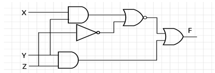
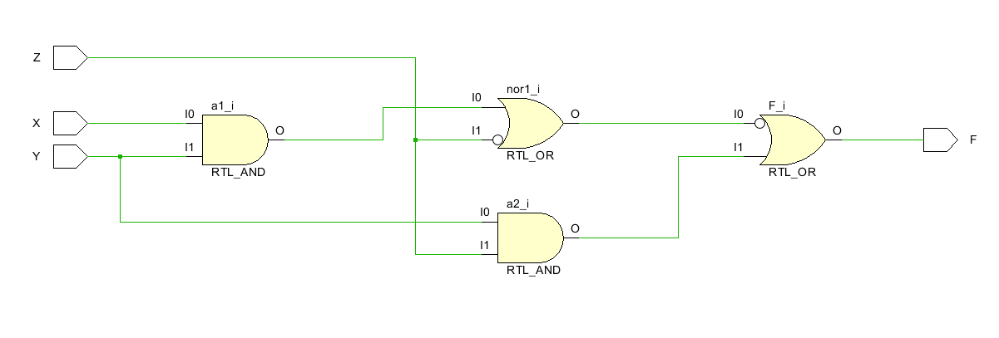

# 实验一 门级电路的实现

## 一、实验要求

需完成设计代码和仿真代码的实现，要求仿真代码实现所有真值的覆盖，并在提交报告时给出设计代码、仿真代码、RTL图和仿真波形图。

## 二、主要实验过程

使用`verilog`根据图示编写门级电路的代码，然后编写模拟程序，覆盖三个输入的8种可能，然后运行模拟，仿真，打开RTL图进行检验对比

## 三、主要实现代码

## 四、仿真结果

