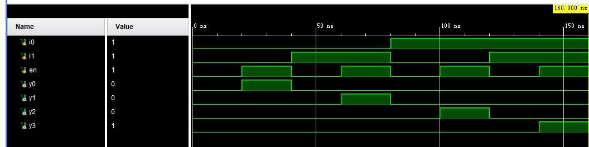
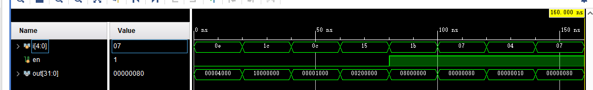

# 实验一 译码器

## 一、实验要求

请用代码实现带使能端的2-4译码器、5-32译码器电路，模块分别命名为：

module DEC2T4E (I0, I1, En, Y0, Y1, Y2, Y3)和

module DEC5T32E (I, En, Y)

其中I信号为5位宽，Y为32位宽

## 二、主要实验过程

计算出每一个输出端的逻辑表达式，有些表达式太多就用python自动生成，使用verilog分别编写门级电路和功能级电路

## 三、主要实现代码

### DEC2T4E

门级design

~~~verilog
module DEC2T4E_door(i0,i1,en,y0,y1,y2,y3);
    input i0,i1,en;
    output y0,y1,y2,y3;
    not n1(i0_n,i0);
    not n2(i1_n,i1);
    and(y0,i0_n,i1_n,en);
    and(y1,i0_n,i1,en);
    and(y2,i0,i1_n,en);
    and(y3,i0,i1,en);
endmodule
~~~

功能性design

~~~verilog
module DEC2T4E_func(i0,i1,en,y0,y1,y2,y3);
    input i0,i1,en;
    output y0,y1,y2,y3;
    assign y0 = (~i0)&(~i1)&en;
    assign y1 = (~i0)&i1&en;
    assign y2 = i0&(~i1)&en;
    assign y3 = i0&i1&en;
endmodule
~~~

simulation

~~~verilog
module simu_DEC2T4E();
    reg i0,i1,en;
    wire y0,y1,y2,y3;
    DEC2T4E_func t1(
        .i0(i0),
        .i1(i1),
        .en(en),
        .y0(y0),
        .y1(y1),
        .y2(y2),
        .y3(y3)
    );
    initial begin
        #0 i0 = 0;i1 = 0;en = 0;
        #20 i0 = 0;i1 = 0;en = 1;
        #20 i0 = 0;i1 = 1;en = 0;
        #20 i0 = 0;i1 = 1;en = 1;
        #20 i0 = 1;i1 = 0;en = 0;
        #20 i0 = 1;i1 = 0;en = 1;
        #20 i0 = 1;i1 = 1;en = 0;
        #20 i0 = 1;i1 = 1;en = 1;
        #20 $finish;
    end
endmodule
~~~

### DET5T32E

门级design

~~~

~~~

功能级design

~~~verilog
module DEC5T32E_func(i,en,y);
    input [4:0]i;
    input en;
    output [31:0]y;
    function [31:0]dec;
        input [31:0]i;
        case (i)
            5'b00000:dec = 32'b00000000000000000000000000000001;
            5'b00001:dec = 32'b00000000000000000000000000000010;
            5'b00010:dec = 32'b00000000000000000000000000000100;
            5'b00011:dec = 32'b00000000000000000000000000001000;
            5'b00100:dec = 32'b00000000000000000000000000010000;
            5'b00101:dec = 32'b00000000000000000000000000100000;
            5'b00110:dec = 32'b00000000000000000000000001000000;
            5'b00111:dec = 32'b00000000000000000000000010000000;
            5'b01000:dec = 32'b00000000000000000000000100000000;
            5'b01001:dec = 32'b00000000000000000000001000000000;
            5'b01010:dec = 32'b00000000000000000000010000000000;
            5'b01011:dec = 32'b00000000000000000000100000000000;
            5'b01100:dec = 32'b00000000000000000001000000000000;
            5'b01101:dec = 32'b00000000000000000010000000000000;
            5'b01110:dec = 32'b00000000000000000100000000000000;
            5'b01111:dec = 32'b00000000000000001000000000000000;
            5'b10000:dec = 32'b00000000000000010000000000000000;
            5'b10001:dec = 32'b00000000000000100000000000000000;
            5'b10010:dec = 32'b00000000000001000000000000000000;
            5'b10011:dec = 32'b00000000000010000000000000000000;
            5'b10100:dec = 32'b00000000000100000000000000000000;
            5'b10101:dec = 32'b00000000001000000000000000000000;
            5'b10110:dec = 32'b00000000010000000000000000000000;
            5'b10111:dec = 32'b00000000100000000000000000000000;
            5'b11000:dec = 32'b00000001000000000000000000000000;
            5'b11001:dec = 32'b00000010000000000000000000000000;
            5'b11010:dec = 32'b00000100000000000000000000000000;
            5'b11011:dec = 32'b00001000000000000000000000000000;
            5'b11100:dec = 32'b00010000000000000000000000000000;
            5'b11101:dec = 32'b00100000000000000000000000000000;
            5'b11110:dec = 32'b01000000000000000000000000000000;
            5'b11111:dec = 32'b10000000000000000000000000000000;
        endcase
    endfunction
    assign y = dec(i);
    wire zero = 32'b00000000000000000000000000000000;
    MUX2X32_func f1(zero,i,en);
endmodule
~~~

simulation

~~~verilog
module simu_DEC5T32E();
    reg [4:0]i;
    reg en;
    wire [31:0]out;
    DEC5T32E_func t1(
        .i(i),
        .en(en),
        .y(out)
    );
    initial begin
        #0 i = 5'b01110;en = 0;
        #20 i = 5'b11100;en = 0;
        #20 i = 5'b01100;en = 0;
        #20 i = 5'b10101;en = 0;
        #20 i = 5'b11011;en = 1;
        #20 i = 5'b00111;en = 1;
        #20 i = 5'b00100;en = 1;
        #20 i = 5'b00111;en = 1;
        #20 $finish;
    end
endmodule
~~~

## 四、仿真结果

### DET2T4E

### DEC5T32E

