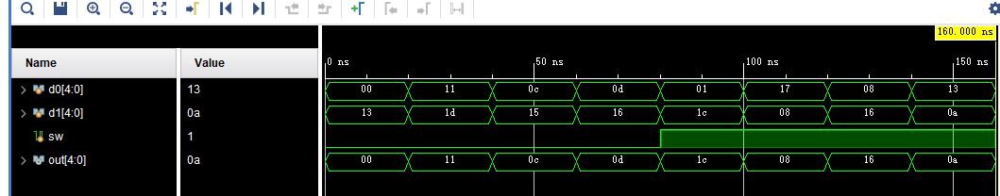
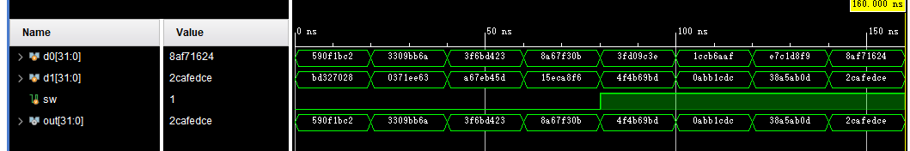
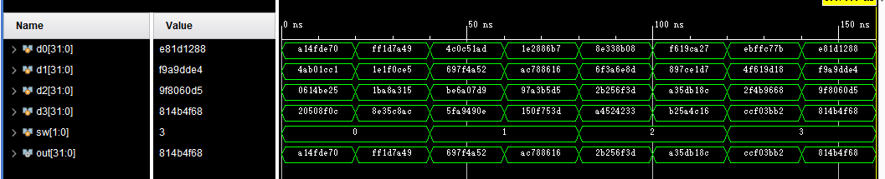

# 实验二 多路选择器

## 一、实验要求

包括5位二选一选择器，32位二选一选择器，32位4选一选择器，模块命名格式和每个选择器的输入输出参数要求分别为：

l  5位二选一选择器（MUX2X5） 模块参数列表：module MUX2X5 (A0,A1,S,Y);

l  32位二选一选择器（MUX2X32） 模块参数列表：module MUX2X32 (A0,A1,S,Y);

l  32位四选一选择器（MUX4X32） 模块参数列表：module MUX4X32 (A0,A1,A2,A3,S,Y);

## 二、主要实验过程

### 门级电路实现

在`verilog`中键入三个选择器的门级实现代码，然后通过嵌套多个二选一达到选择多位的目的

### 功能级实现

在Verilog中键入类似于C语言一样的代码，通过case的方式来实现

## 三、主要实现代码

共有模块MUX2X1

```verilog
module MUX2X1_gate(a0,a1,s,y);
    input a0,a1,s;
    output y;
    not n1(s_n,s);
    and and1(and_1,s_n,a0);
    and and2(and_2,s,a1);
    or or1(y,and_1,and_2);
endmodule
```


#### MUX2X5

门级design

```verilog
module MUX2X5_gate(a0,a1,s,y);
    input [4:0]a0,a1;
    input s;
    output [4:0]y;
    MUX2X1_gate g0(a0[0],a1[0],s,y[0]);
    MUX2X1_gate g1(a0[1],a1[1],s,y[1]);
    MUX2X1_gate g2(a0[2],a1[2],s,y[2]);
    MUX2X1_gate g3(a0[3],a1[3],s,y[3]);
    MUX2X1_gate g4(a0[4],a1[4],s,y[4]);
endmodule
```

功能性design

```verilog
module MUX4X32(a0,a1,a2,a3,s,y);
    input [31:0] a0,a1,a2,a3;
    input s;
    output [31:0]y;
    function [31:0]select;
        input [31:0]a0,a1,a2,a3;
        input s;
        case (s)
            2'b00:select = a0;
            2'b01:select = a1;
            2'b10:select = a2;
            2'b11:select = a3; 
        endcase
    endfunction
    assign y = select(a0,a1,a2,a3,s);
endmodule
```


simulation

```verilog
module simu_MUX2X5();
    reg [4:0]d0,d1;
    reg sw;
    wire [4:0]out;
    MUX2X5_gate t1(.a0(d0),.a1(d1),.s(sw),.y(out));
    initial begin
        #0     d0 = 5'b00000; d1 = 5'b10011; sw = 0;
        #20    d0 = 5'b10001; d1 = 5'b11101; sw = 0;
        #20    d0 = 5'b01100; d1 = 5'b10101; sw = 0;
        #20    d0 = 5'b01101; d1 = 5'b10110; sw = 0;
        #20    d0 = 5'b00001; d1 = 5'b11100; sw = 1;
        #20    d0 = 5'b10111; d1 = 5'b01000; sw = 1;
        #20    d0 = 5'b01000; d1 = 5'b10110; sw = 1;
        #20    d0 = 5'b10011; d1 = 5'b01010; sw = 1;
        #20 $finish;
    end
endmodule
```

#### MUX2X32

design

```verilog
module MUX2X32_gate(a0,a1,s,y);
    input [31:0]a0,a1;
    input s;
    output [31:0]y;
    MUX2X1_gate g0(a0[0],a1[0],s,y[0]);
    MUX2X1_gate g1(a0[1],a1[1],s,y[1]);
    MUX2X1_gate g2(a0[2],a1[2],s,y[2]);
    MUX2X1_gate g3(a0[3],a1[3],s,y[3]);
    MUX2X1_gate g4(a0[4],a1[4],s,y[4]);
    MUX2X1_gate g5(a0[5],a1[5],s,y[5]);
    MUX2X1_gate g6(a0[6],a1[6],s,y[6]);
    MUX2X1_gate g7(a0[7],a1[7],s,y[7]);
    MUX2X1_gate g8(a0[8],a1[8],s,y[8]);
    MUX2X1_gate g9(a0[9],a1[9],s,y[9]);
    MUX2X1_gate g10(a0[10],a1[10],s,y[10]);
    MUX2X1_gate g11(a0[11],a1[11],s,y[11]);
    MUX2X1_gate g12(a0[12],a1[12],s,y[12]);
    MUX2X1_gate g13(a0[13],a1[13],s,y[13]);
    MUX2X1_gate g14(a0[14],a1[14],s,y[14]);
    MUX2X1_gate g15(a0[15],a1[15],s,y[15]);
    MUX2X1_gate g16(a0[16],a1[16],s,y[16]);
    MUX2X1_gate g17(a0[17],a1[17],s,y[17]);
    MUX2X1_gate g18(a0[18],a1[18],s,y[18]);
    MUX2X1_gate g19(a0[19],a1[19],s,y[19]);
    MUX2X1_gate g20(a0[20],a1[20],s,y[20]);
    MUX2X1_gate g21(a0[21],a1[21],s,y[21]);
    MUX2X1_gate g22(a0[22],a1[22],s,y[22]);
    MUX2X1_gate g23(a0[23],a1[23],s,y[23]);
    MUX2X1_gate g24(a0[24],a1[24],s,y[24]);
    MUX2X1_gate g25(a0[25],a1[25],s,y[25]);
    MUX2X1_gate g26(a0[26],a1[26],s,y[26]);
    MUX2X1_gate g27(a0[27],a1[27],s,y[27]);
    MUX2X1_gate g28(a0[28],a1[28],s,y[28]);
    MUX2X1_gate g29(a0[29],a1[29],s,y[29]);
    MUX2X1_gate g30(a0[30],a1[30],s,y[30]);
    MUX2X1_gate g31(a0[31],a1[31],s,y[31]);
endmodule
```

simulation

```verilog
module simu_MUX2X32();
    reg [31:0]d0,d1;
    reg sw;
    wire [31:0]out;
    MUX2X32_gate t1(.a0(d0),.a1(d1),.s(sw),.y(out));
    initial begin
        #0    d0 = 32'b01011001000011110001101111000010; d1 = 32'b10111101001100100111000000101000; sw = 0;
        #20    d0 = 32'b00110011000010011011101101101010; d1 = 32'b00000011011100011110111001100011; sw = 0;
        #20    d0 = 32'b00111111011010111101010000100011; d1 = 32'b10100110011111101011010001011101; sw = 0;
        #20    d0 = 32'b10001010011001111111001100001011; d1 = 32'b00010101111011001010100011110110; sw = 0;
        #20    d0 = 32'b00111111110100001001110000111110; d1 = 32'b01001111010010110110100110111101; sw = 1;
        #20    d0 = 32'b00011100110010110110101010101111; d1 = 32'b00001010101110110001110011011100; sw = 1;
        #20    d0 = 32'b11100111110000011101100011111001; d1 = 32'b00111000101001011010101100001101; sw = 1;
        #20    d0 = 32'b10001010111101110001011000100100; d1 = 32'b00101100101011111110110111001110; sw = 1;
        #20 $finish;
    end
endmodule
```

#### MUX4X32

design

~~~verilog
module MUX4X32_gate(a0,a1,a2,a3,s,y);
    input [31:0]a0,a1,a2,a3;
    input [1:0]s;
    output [31:0]y;
    wire [31:0]y_0,y_1;
    MUX2X32_gate ge0(a0,a1,s[0],y_0);
    MUX2X32_gate ge1(a2,a3,s[0],y_1);
    MUX2X32_gate two2(y_0,y_1,s[1],y);
endmodule
~~~

simulation

```verilog
module simu_MUX4X32();
    reg [31:0]d0,d1,d2,d3;
    reg [1:0]sw;
    wire [31:0]out;
    MUX4X32_gate t1(.a0(d0),.a1(d1),.a2(d2),.a3(d3),.s(sw),.y(out));
    initial begin
#0    d0 = 32'b10100001010011111101111001110000; d1 = 32'b01001010101100000001110011000001;d2 = 32'b00000110000101001011111000100101;d3 = 32'b00100000010100001000111100001100;sw = 2'b00;
#20    d0 = 32'b11111111000111010111101001001001; d1 = 32'b00011110000111110000110011100101;d2 = 32'b00011011101010001010001100010101;d3 = 32'b10001110001101011100100010101100;sw = 2'b00;
#20    d0 = 32'b01001100000011000101000110101101; d1 = 32'b01101001011111110100101001010010;d2 = 32'b10111110011010100000011111011001;d3 = 32'b01011111101010010100100100001110;sw = 2'b01;
#20    d0 = 32'b00011110001010001000011010110111; d1 = 32'b10101100011110001000011000010110;d2 = 32'b10010111101000111011010111010101;d3 = 32'b00010101000011110111010100111101;sw = 2'b01;
#20    d0 = 32'b10001110001100111000101100001000; d1 = 32'b01101111001110100110111010001101;d2 = 32'b00101011001001010110111100111101;d3 = 32'b10100100010100100100001000110011;sw = 2'b10;
#20    d0 = 32'b11110110000110011100101000100111; d1 = 32'b10001001011111001110000111010111;d2 = 32'b10100011010111011011000110001100;d3 = 32'b10110010010110100100110000010110;sw = 2'b10;
#20    d0 = 32'b11101011111111111100011101111011; d1 = 32'b01001111011000011001110100011000;d2 = 32'b00101111010010111001011001101000;d3 = 32'b11001100111100000011101110110010;sw = 2'b11;
#20    d0 = 32'b11101000000111010001001010001000; d1 = 32'b11111001101010011101110111100100;d2 = 32'b10011111100000000110000011010101;d3 = 32'b10000001010010110100111101101000;sw = 2'b11;
        #20 $finish;
    end
endmodule
```

## 四、仿真结果

## 门级电路

### MUX2X5



#### MUX2X32



MUX4X32

