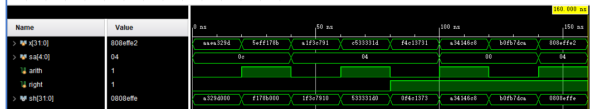

# 实验五 移位器

## 一、实验要求

请用代码实现32位移位器，支持算术和逻辑左移、右移操作，模块命名为：

`module SHIFTER_32(X, Sa, Arith, Right, Sh)`

其中 ：`X`为32位的输入；`Sa`为5位的移位量；`Arith`是算术或逻辑移位标识，1为算术移位，0为逻辑移位；`Right`为右移或左移标识，1为右移，0为左移；`Sh`为32位的结果输出。

## 二、主要实验过程

在`Verilog`中编写门级和功能级描述代码，在`python`中生成随机样例进行仿真

## 三、主要实现代码

功能级design

~~~verilog
module shifter32_func(x,sa,arith,right,sh);
    input [31:0]x;
    input [4:0] sa;
    input arith,right;
    output[31:0] sh;
    integer shiftAmount;
    integer res;
    always @(sa) begin
        shiftAmount = sa;
    end
    always @(*) 
        begin
            if(arith == 0)
                begin
                    if(right == 0)
                    res = x<<shiftAmount;
                else
                    res = x>>shiftAmount;
                end
            else
                begin
                    if(right == 0)
                    res = x<<<shiftAmount;
                    else
                    res = x>>>shiftAmount;
                end
        end
    assign sh = res;
endmodule
~~~

门级design

~~~verilog

~~~

simulation

~~~verilog
module simu();
    reg [31:0]x;
    reg [4:0]sa;
    reg arith,right;
    wire [31:0] sh;
    shifter32_func t1 (.x(x),.sa(sa),.arith(arith),.right(right),.sh(sh));
    initial begin
        #0 x=32'b10101010111010100011001010011101; sa = 12 ;arith = 0; right = 0;
        #20 x=32'b01011110111111110001011110001011; sa = 12 ;arith = 1; right = 0;
        #20 x=32'b10100001111100111100011110010001; sa = 4 ;arith = 0; right = 0;
        #20 x=32'b11000101001100110011001100011101; sa = 4 ;arith = 1; right = 0;
        #20 x=32'b11110100110000010011011100110001; sa = 4 ;arith = 0; right = 1;
        #20 x=32'b10100011010000010100011011001000; sa = 0 ;arith = 1; right = 1;
        #20 x=32'b10110000111110110111110111001010; sa = 0 ;arith = 0; right = 1;
        #20 x=32'b10000000100011101111111111100010; sa = 4 ;arith = 1; right = 1;
        #20 $finish;
    end
endmodule
~~~

## 四、仿真结果

