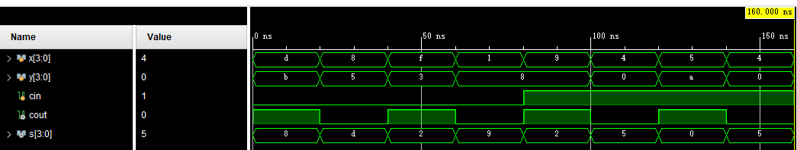

# 实验四 加法器

## 一、实验要求

请用代码实现该4位超前进位加法器的门级电路，模块命名为：

`module CLA_4 (X, Y, Cin, S, Cout)`

其中`X`，`Y`和`S`信号均为4位宽，`Cin`和`Cout`为1位宽

## 二、主要实验过程

在`verilog`中编写超前进位加法器的门级和功能级代码，用`python`生成测试样例进行测试

## 三、主要实现代码

### 功能级design

~~~verilog
module CLA4_func(x,y,cin,s,cout);
    input [3:0]x,y;
    input cin,cout;
    output [3:0]s;
    assign s = x+y+cin;
    integer carry = 0;
    always @(*) 
    if(s<(x+cin) || s<(y+cin)) begin
        carry = 1;
    end  
    else begin
        carry = 0;
    end
    assign cout = carry;
endmodule
~~~

### 门级design

~~~verilog
module CLA4_door(x,y,cin,s,cout);
    input [3:0]x,y;
    input cin;
    output [3:0]s;
    output cout;
    wire [3:0]p,g,ng,couts;
    and a0(g[0],x[0],y[0]);
    or o0(p[0],x[0],y[0]);
    and a1(g[1],x[1],y[1]);
    or o1(p[1],x[1],y[1]);
    and a2(g[2],x[2],y[2]);
    or o2(p[2],x[2],y[2]);
    and a3(g[3],x[3],y[3]);
    or o3(p[3],x[3],y[3]);
    not n0 (ng[0],g[0]);
    not n1 (ng[1],g[1]);
    not n2 (ng[2],g[2]);
    not n3 (ng[3],g[3]);
    //cout0
    and cout00 (t01,p[0],cin);
    or cout01 (couts[0],g[0],t1);
    //cout1
    and cout10 (t11,p[1],g[0]);
    and cout11 (t12,p[1],p[0],cin);
    or cout12 (couts[1],g[1],t11,t12);
    //cout2
    and cout20 (t21,p[2],g[1]);
    and cout21 (t22,p[2],p[1],g[0]);
    and cout22 (t23,p[2],p[1],p[0],cin);
    or cout23 (couts[2],g[2],t21,t22,t23);
    //cout3
    and cout30(t31,p[3],g[2]);
    and cout31(t32,p[3],p[2],g[1]);
    and cout32(t33,p[3],p[2],p[1],g[0]);
    and cout33(t34,p[3],p[2],p[1],p[0],cin);
    or cout34(couts[3],g[3],t31,t32,t33,t34);
    //sum
    and sum31(t3,p[3],ng[3]);xor sum32(s[3],t3,couts[2]);
    and sum21(t2,p[2],ng[2]);xor sum22(s[2],t2,couts[1]);
    and sum11(t1,p[1],ng[1]);xor sum12(s[1],t1,couts[0]);
    and sum01(t0,p[0],ng[0]);xor sum02(s[0],t0,cin);
    assign cout = couts[3];
endmodule
~~~

simulation

~~~verilog
module CLA4_simu();
    reg [3:0]x,y;
    reg cin;
    wire cout;
    wire [3:0] s;
    CLA4_func t1 (
                .x(x),
                .y(y),
                .cin(cin),
                .cout(cout),
                .s(s));
    initial begin
    #0 x = 4'b1101; y = 4'b1011;cin = 0;
    #20 x = 4'b1000; y = 4'b0101;cin = 0;
    #20 x = 4'b1111; y = 4'b0011;cin = 0;
    #20 x = 4'b0001; y = 4'b1000;cin = 0;
    #20 x = 4'b1001; y = 4'b1000;cin = 1;
    #20 x = 4'b0100; y = 4'b0000;cin = 1;
    #20 x = 4'b0101; y = 4'b1010;cin = 1;
    #20 x = 4'b0100; y = 4'b0000;cin = 1;
    #20 $finish;
    end
endmodule
~~~

## 四、仿真结果

